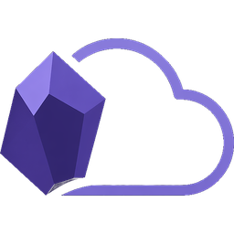

<p align="center">
  
</p>

<h1 align="center">Bring Your Own Cloud (BYOC)</h1>

<p align="center">
  <a href="https://bringyourowncloud.xyz"><strong>bringyourowncloud.xyz</strong></a><br><br>
  A clean, self-hosted synchronization plugin for <a href="https://obsidian.md">Obsidian</a>.
</p>

BYOC is a community-maintained fork of the excellent [Remotely Save](https://github.com/remotely-save/remotely-save) plugin. This version focuses on providing a clean, completely self-hosted experience while maintaining the robust sync engine created by the original developers.

---

## Features

- **12 cloud providers** — S3, WebDAV, Dropbox, OneDrive (AppFolder & Full), Google Drive, Box, pCloud, Yandex Disk, Koofr, Azure Blob Storage, Webdis
- **3-Way Merge Sync Engine** — tracks a local baseline to make correct push/pull/conflict decisions across sessions
- **Smart Conflict Resolution** — automatically creates timestamped conflict copies instead of silently overwriting
- **Independent Authorization** — connect your own cloud provider APIs with credentials that persist locally.
- **End-to-end encryption** — optional AES-256 / rclone-crypt encryption before data leaves your device
- **Auto-sync** — timed background sync and sync-on-save
- **Seamless migration** — automatically imports your existing Remotely Save config on first load

---

## Installation

### Via BRAT (recommended)

[BRAT](https://github.com/TfTHacker/obsidian42-brat) lets you install and auto-update plugins that aren't in the Obsidian community directory.

1. Install the **BRAT** plugin from the Obsidian community plugins directory and enable it.
2. Open BRAT settings and click **Add Beta plugin**.
3. Enter the repository URL: `https://github.com/winters27/obsidian-byoc`
4. Click **Add Plugin** — BRAT will download the latest release and enable it automatically.

BRAT will notify you when a new version is available and can update with one click.

### Manual install

1. Download `main.js`, `manifest.json`, and `styles.css` from the [latest release](../../releases/latest).
2. Create the folder `<vault>/.obsidian/plugins/byoc/` and copy the three files into it.
3. In Obsidian, open **Settings → Community plugins**, click the refresh icon under "Installed plugins" if BYOC doesn't appear, and toggle **Bring Your Own Cloud** on.

If Community plugins is disabled (Restricted mode), turn it on first — Obsidian will warn you about third-party code, which is expected.

### Building from source

For developers who want to run a local build, or to use BYOC with their own OAuth client IDs:

```bash
git clone https://github.com/winters27/obsidian-byoc
cd obsidian-byoc
npm install
npm run build
```

The build emits `main.js`, `manifest.json`, and `styles.css` in the repo root. Copy those three files into `<vault>/.obsidian/plugins/byoc/` (create the folder if it doesn't exist), then reload Obsidian (Ctrl/Cmd+R) and enable the plugin under **Settings → Community plugins**.

To swap in your own OAuth credentials before building, copy `.env.example.txt` to `.env` and fill in the relevant `*_CLIENT_ID` / `*_CLIENT_SECRET` values — webpack's DefinePlugin bakes them into `main.js` at build time.

---

## Provider Setup

### S3-Compatible (AWS, Cloudflare R2, Backblaze B2, MinIO, etc.)

Enter your endpoint, region, access key ID, secret key, and bucket name in plugin settings.

### WebDAV

Enter your server URL, username, and password. Works with Nextcloud, ownCloud, Synology, and any WebDAV server.

### Dropbox / OneDrive / Google Drive / Box / Yandex Disk / Koofr

Click **Auth** in the provider settings panel. You'll be redirected to the provider's OAuth page, then back to Obsidian automatically.

### pCloud

Click **Auth** in pCloud settings. Select your region (US or EU) during the OAuth flow. Your access token is stored locally and never expires.

> **Note:** BYOC uses a registered pCloud application. If you have your own pCloud API key, you can override it by setting the `PCLOUD_CLIENT_ID` and `PCLOUD_CLIENT_SECRET` environment variables before building.

### Azure Blob Storage

Enter your container SAS URL and container name.

---

## Configuration

All settings are in Obsidian → Settings → **Bring Your Own Cloud**.

| Setting | Description |
|---------|-------------|
| **Service** | Which cloud provider to sync with |
| **Password** | Optional encryption passphrase |
| **Auto Sync Interval** | Sync every N milliseconds (−1 to disable) |
| **Sync on Save** | Sync N ms after the last file change |
| **Conflict Action** | `keep_newer`, `keep_larger`, or `smart_conflict` |
| **Sync Direction** | Bidirectional (default), or one-way push/pull modes that never touch the other side |
| **Protect Modify %** | Abort if more than N% of files would be changed |
| **Sync Config Dir** | Whether to sync `.obsidian/` settings |
| **Delete To** | Move deleted files to system trash or Obsidian trash |
| **Paths To Ignore** | Patterns (glob or regex) that are never synced |
| **Paths To Allow** | If set, only matching paths are synced |

---

## Known limitations

### Symlinks

Obsidian only exposes its resolved file index, so BYOC cannot tell a symlink
from a regular file. Symlinked files upload like copies, a directory symlink
uploads its contents under the vault path, and a broken symlink disappears
from the index entirely. Since 1.0.16 a broken symlink no longer crashes the
sync, and on desktop BYOC checks the real disk before treating an
index-absent path as deleted, so the remote copy of a dangling link is kept.

Symlinks are still not synced as links. The reliable setup is to exclude them
with **Paths To Ignore**, one pattern per link. A regex must match the link
itself, not only its children:

```text
^path/to/link($|/)
```

The equivalent glob pair also works: `path/to/link` plus `path/to/link/**`.

## Migrating from Remotely Save

BYOC automatically detects your Remotely Save `data.json` on first launch and imports all credentials and settings. A backup of your current config is created at `.obsidian/plugins/byoc/data.json.byoc-backup` before any changes are made.

## Credits

BYOC is a fork of **Remotely Save**, originally created by [fyears](https://github.com/remotely-save). The core sync algorithm, multi-provider architecture, and foundational logic are the result of their exceptional work. 

We are incredibly grateful to the original developer for creating such a robust tool and making it open source. If you are looking for the original plugin, please visit the [Remotely Save Repository](https://github.com/remotely-save/remotely-save).

---

## License

[MIT](LICENSE), copyright 2026 winters27.

BYOC started as a fork of Remotely Save and has since been substantially rewritten. It is distributed under the MIT license. See [Credits](#credits) for attribution to the original project.
